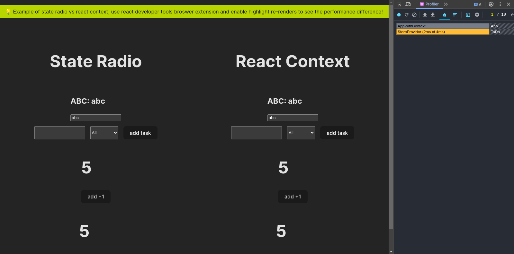

# State Radio 📻 - React

A state management library that let's you tune to your state channels via subscriptions and listen to state updates with fine tuned simplicity.

Here is a guide on how to use it specifically in react, spoiler, it's more performant than react context given react rerenders all your components on change if they share the same context provider, but here we only rerender the single component that depends on the changed state, very modular and fine grained way to work with state in whatever framework you use.

This might not be so much of performance upgrade for signal based frameworks which use signals or simillar reactive mechanisms to manage state, but for react sure it's a big difference, try it yourself for comparison, run the setup in example by cloning this repo, cd to example and install dependencies then run, and you will see something like this, you can then measure rerenders using profiler from react dev tools extension.



💡Note: here we will only show react usage, for full usage of state radio state manager, please check the [state radio docs](https://github.com/Hussseinkizz/state-radio)

## ▶️ Installation

```bash
npm install state-radio-react
```

### Usage In A React Project

-- step 1: create a file called `store.js` and import the library and intialize your initial states, you can also do more things here, like making some state hooks for your application say useAuth or subscribe to state changes if you want. For example:

``` jsx
import { StateRadio } from 'state-radio-react';

const { channels } = new StateRadio();

export const countChannel = channels.addChannel('count', 0);

export const abcChannel = channels.addChannel('abc', 'abc');

countChannel.subscribe((newCount) => {
  console.log('Count Changed to:', newCount);
});

abcChannel.subscribe((newState) => {
  console.log('ABC Changed to:', newState);
});

```

Notice that we exported our state channels so that we can use them else where in our application, you don't need to wrap your app with any provider or so.

-- step 2: use in any of your components by importing any of the channels you created in step 1 and the useChannel hook to allow you consume the channel in react.

``` jsx
import { countChannel } from '../store';
import { useChannel } from 'state-radio-react';

export default function Counter() {
  const [count, setCount] = useChannel(countChannel);

  return (
    <div>
      <h1>{count}</h1>
      <button onClick={() => setCount(count + 1)}>add +1</button>
    </div>
  );
}

```

That's it, for more things you can do with this new found power, check the detailed documentation here [state radio docs](https://github.com/Hussseinkizz/state-radio)

That's it, play around, enjoy the radio show!!!

## Contributing

If you find issues or have ideas for improvements, please open an issue or submit a pull request or contact author at [hssnkizz@gmail.com]('hssnkizz@gmail.com')

This project is licensed under the MIT License.
